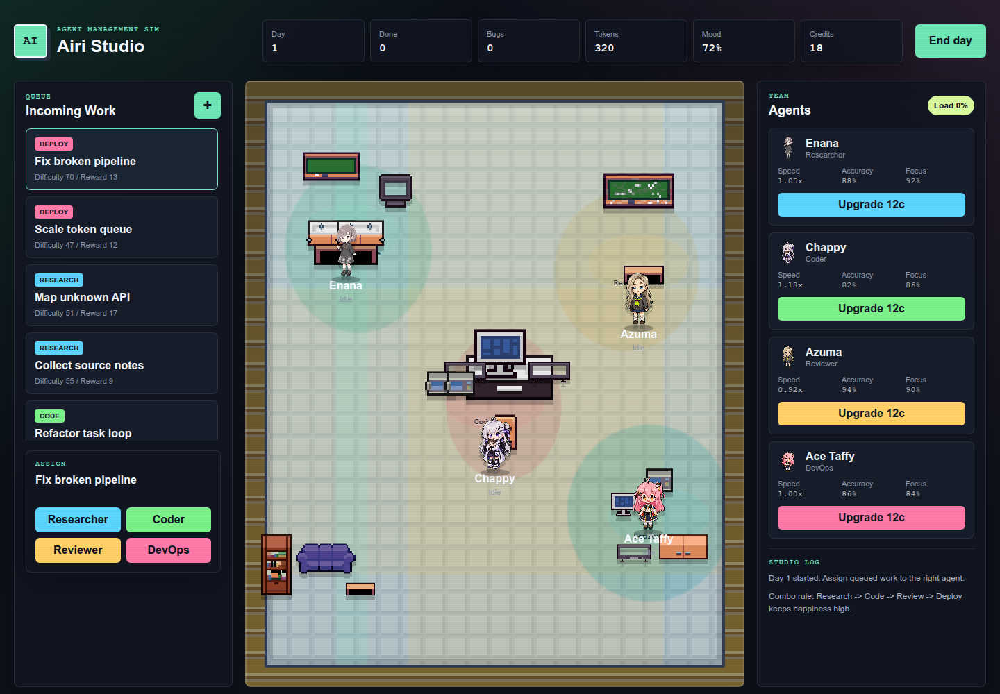
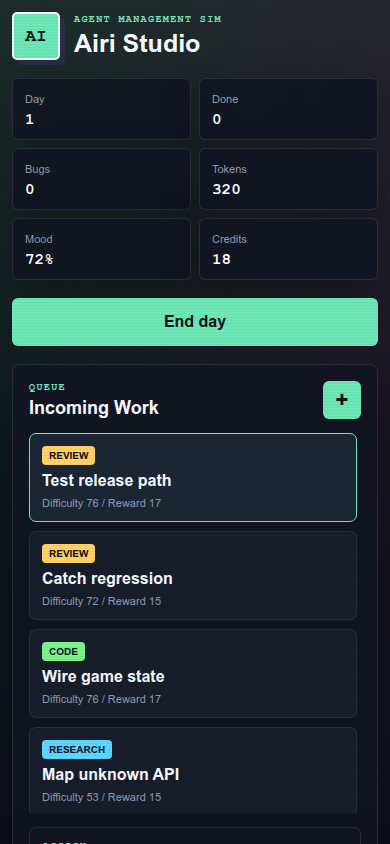

# Airi Studio

Airi Studio is a browser-based React/Vite prototype for managing a small team of anime-style AI agents inside a playful pixel office.

The current build is centered around three connected experiences:

- a **dashboard** with the office map and active work areas
- a **task intake flow** for creating new tasks
- a **Zoo Computer chat workspace** for research-first handoff and follow-up conversations

## What the current build does

- **Version 4 Room Style layout**: Elegant bordered panels organizing the office into logical rooms (Files & Docs, Zoo Computer, Log Station, Meeting Area, Zoo Chat, Pet Zone).
- **Pixel-art furniture rendering**: Real sprite-sheet items (desks, couches, shelves) replacing legacy SVG paths.
- **Interactive rooms**: Hovering over rooms reveals a clean description panel and glows the room with its respective neon color. Clicking redirects to the corresponding view.
- **Dynamic furniture highlights**: Hovering over furniture items scales them up and triggers a drop-shadow glow matching the room's color scheme.
- **Clickable mascot**: Clicking on Tata the cat displays a cute "mew mew" pixel speech bubble.
- **Cyber-neon buttons**: Beautifully styled "+ Create Task" intake button with glowing neon gradients.
- Create a new task from the Tasks screen with a multiline textarea, priority, and type selection.
- Automatically send new tasks to **Zoo Computer** for research intake first and chat directly.

## Interface overview

## Preview

### Main interface



### Mobile / narrow layout



### Dashboard

The dashboard shows the pixel office and the main work areas, including:

- task intake
- document archive
- Zoo Computer
- Zoo chat
- log station

The **Zoo chat** tile on the dashboard includes the Zoo computer visual and reflects active status.


### Tasks screen

The Tasks screen is focused on quick task creation:


- **Task content** uses a textarea for multi-line descriptions
- users pick **Type** and **Priority**
- new tasks are sent straight to Zoo for research intake

### Chat screen

The Zoo chat screen provides a dedicated conversation UI for follow-ups.


It includes:

- chat history
- status pills
- activity banners when Zoo is replying
- a highlight effect when a new assistant response arrives
- auto-scroll to the newest message

## Agents

The current prototype uses four anime-style Codex Pets characters:

- **Enana** — research
- **Ace Taffy** — planning
- **Chappy** — coding
- **Azuma** — review

Selected source links are tracked in `public/pets/selected-anime-pets.json`.

## Visual assets

Character sprites come from Codex Pets:

- `https://codex-pets.net/#/pets/enana`
- `https://codex-pets.net/#/pets/chappy-chan`
- `https://codexpets.net/gallery/azuma`
- `https://codexpets.net/gallery/ace-taffy`

Furniture, wall, and floor sprites are selected from SierraAssets' Pixel Art Furniture Pack on itch.io. The source page states the pack may be used in commercial and non-commercial games, but may not be resold as an asset pack or merchandise. A copy of the downloaded license file is stored at `public/furniture/LICENSE-sierrassets.txt`.

Some selected pets may be community or fan-inspired. Replace them with original anime-style assets before public or commercial deployment if licensing or brand safety becomes important.

## Tech stack

- React 19
- TypeScript
- Vite
- CSS-based pixel UI styling and animation
- Static assets served from `public/`

## Project structure

```text
src/App.tsx                 Main app state, task intake, Zoo chat, dashboard UI
src/App.css                 Layout, office styling, chat UI, sprite animation
src/index.css               Global theme and base styles
public/pets/                Character sprites and source metadata
public/furniture/           Office furniture, wall, floor assets, license
public/favicon.svg          App favicon
api/                        Serverless API endpoints used by the app
```

## Development

```bash
npm install
npm run dev
```

The Vite dev server usually starts at `http://127.0.0.1:5173/`. If that port is busy, Vite will automatically choose the next available port.

## Verification

Run before pushing changes:

```bash
npm run build
```

## Deployment

The repository is configured for deployment on Vercel.

- Repository: `https://github.com/ngoc-thu/airi-studio`
- Build command: `npm run build`
- Output directory: `dist`

To deploy production manually:

```bash
npx vercel --prod --yes
```

## Notes

This README reflects the current prototype direction: a lightweight task + chat workspace with a pixel-office presentation, rather than a pure management sim loop.
